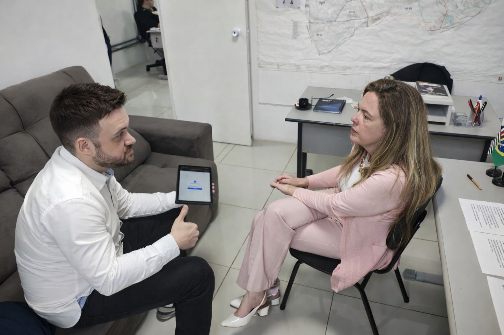
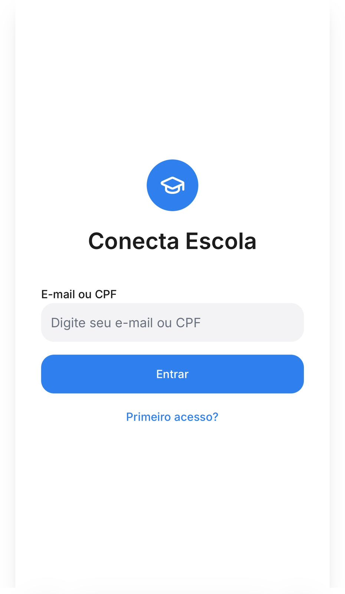
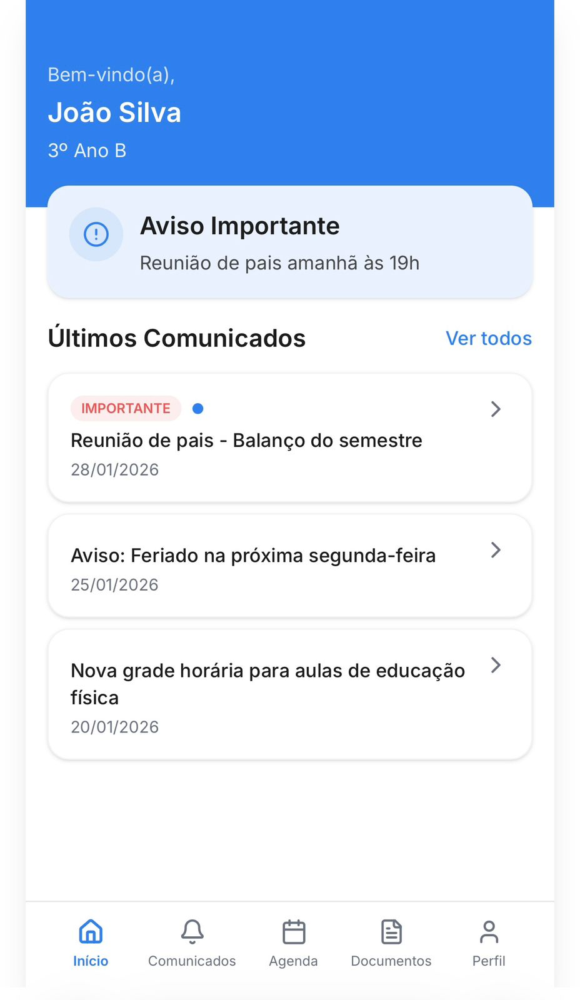
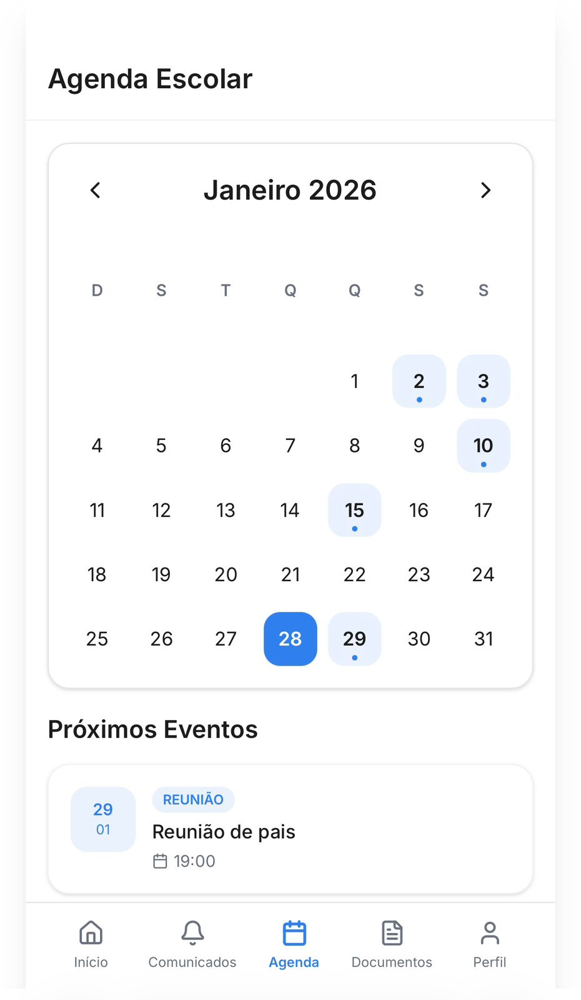
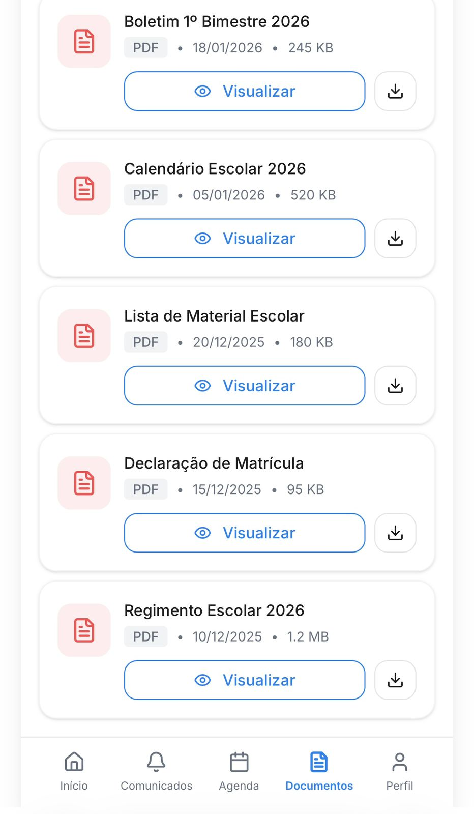

# 📱 Conecta Escola: Transformando a Comunicação na Educação Pública

> **Status do Projeto:** MVP e Validação com Stakeholders Públicos 🏛️

## 📝 Sobre o Projeto
O **Conecta Escola** nasceu de uma dor real: a fragmentação da comunicação entre escolas públicas e responsáveis. Atualmente, o uso de ferramentas informais (WhatsApp) gera desinformação e falta de autonomia para pais e mães. 

Este projeto não é apenas um exercício de design, mas uma proposta de **GovTech** focada em transparência e acessibilidade.

---

## 🚀 O Diferencial: Da Concepção à Câmara Municipal
Diferente de projetos puramente acadêmicos, o Conecta Escola foi levado ao campo para validação de mercado e viabilidade política:

* **Articulação Estratégica:** Apresentação do projeto à Vereadora Jacira Chavare, na Câmara Municipal na cidade de Americana - SP.
* **Foco em Negócios:** Discussão de viabilidade para implementação em nível municipal e estadual.
* **Proatividade:** Identificação de stakeholders e defesa da solução como política pública.

  
  
  
  
   
  <em>Da validação estratégica à interface: Reunião na Câmara de Americana e o protótipo funcional do Conecta Escola.</em>

---

## 🛠️ Tecnologias e Metodologias
Para a viabilização deste MVP, utilizei um stack focado em agilidade e entrega de valor:
* **UX Research:** Identificação de dores reais de pais e responsáveis.
* **UI Design (Figma):** Criação de uma interface limpa, objetiva e inclusiva.
* **IA Generativa:** Utilizada para otimização do fluxo de design e prototipagem rápida.
* **Visão Comercial:** Estruturação da proposta de valor para o setor público.

---

## 📱 Funcionalidades Principais
1. **Perfil Multi-Responsável:** Acesso simultâneo para pais/mães (ideal para casos de guarda compartilhada).
2. **Central de Documentos:** Acesso a boletins e circulares em PDF.
3. **Agenda Institucional:** Datas de reuniões, provas e feriados.
4. **Transparência Alimentar:** Acompanhamento do cardápio escolar.

  
  

  
  

  <em>Fluxo principal do Conecta Escola: Interface intuitiva focada na autonomia dos responsáveis e organização institucional.</em>

---

## 📈 Próximos Passos
* Reunião com a Secretaria de Educação do Estado para expansão.
* Refinamento das métricas de engajamento escolar.

---

## 👤 Contato
Estou em busca de oportunidades onde possa unir minha **visão comercial/estratégica** com meu interesse por **tecnologia**.

- **LinkedIn:** [https://www.linkedin.com/in/vinicius-chavari-69a657392/]
- **Cidade:** Americana - SP
